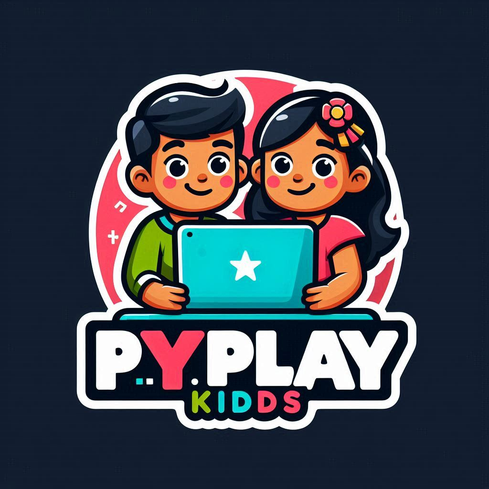

---

### 📚 Projeto de Extensão do Curso de Engenharia de Software 

---
- Univeridade Anhanguera Educacional
- EAD (Ampli)
-  Plataforma Online de de aprendizado da linguagem Python para crianças de 4 a 10 Anos
---

### 🎯 Objetivo do Projeto

 Este projeto visa criar uma plataforma divertida e educativa que introduz crianças de 4 a 10 anos ao mundo da programação atraveź da lingugem Python. 
 
 Ao aprenderem brincando, as crianças desenvolvem habilidades essenciais que podem beneficiar seu futuro acadêmico e profissional. 

---

### 🚀 Ferramentas

- Django
- Python 3.8+
- PostgreSQL
- Visual Studio Code

---

  &nbsp;&nbsp;
  &nbsp;&nbsp; 
&nbsp;&nbsp;
  &nbsp;&nbsp;
  &nbsp;&nbsp;
  &nbsp;&nbsp;
  

